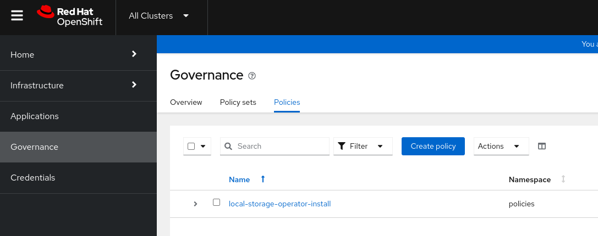

# ACM Policies for Openshift

The goal of this project is to configure an Openshift cluster in a fully automated way with the less possible manual intervention.

The starting point for this configuration is a fully deployed OCP 4 cluster.

## ACM installation

Before ACM policies can be used to configure the OCP cluster, the RHACM operator must be installed and configured. Ansible is used for this tak.

**Ansible installation** 

To intall ansible core components use the following command in the host where the playbooks are going to be run:
```
sudo python3 -m pip install ansible
```
Check the ansible modules and check if the kubernetes.core collection is installed:

```
ansible-galaxy collection list
...
kubernetes.core               1.2.1 
...
```
If the [version is old](https://galaxy.ansible.com/ui/repo/published/kubernetes/core/), like in this case, update the kubernetes core andible modules, run this command as the user who will run the playbooks:
```
ansible-galaxy collection install kubernetes.core --upgrade
```
Verify that the kubernetes core modules have been updated
```
ansible-galaxy collection list

...
# /home/lab-user/.ansible/collections/ansible_collections
Collection      Version
--------------- -------
kubernetes.core 3.0.1
```
Install the kubernetes python libraries:
```
sudo python3 -m pip install kubernetes
```

**Prepare for playbook execution**

Clone this git repository
```
git clone https://github.com/tale-toul/ACMPolicies.git

cd ACMPolicies
```

Log into the cluster with the kubeadmin user
```
oc login -u kubeadmin -p aqRan...FM2CU https://api.cluster-9d8bq.9d8bq.sandbox1171.opentlc.com:6443
```

In order for ansible to stablish a secure connections with the Openshift API, the k8s ansible modules need access to the root CA certificate used by the cluster's API service. Obtain the CA bundle running the following command.

Make sure the resulting file is stored in the Ansible directory:

```
oc rsh -n openshift-authentication $(oc get po -o name -n openshift-authentication|head -1) cat /run/secrets/kubernetes.io/serviceaccount/ca.crt > Ansible/api-ca.crt
```
The playbook requires cluster admin credentials so it can make configuration changes to the cluster. The credentials are expected in the file **Ansible/group_vars/user_credentials.vault**.

The credentials must be assigned to the variable **token**, its value can be obtained using the following command:  
```
$ oc whoami -t
sha256~roxev5_y0w4o-VjSadl3tiTkXqSOVhCRMvmV-K3xpfw
```
The contents of the **Ansible/group_vars/user_credentials.vault** file should look like:
```
token: sha256~roxev5_y0w4o-VjSadl3tiTkXqSOVhCRMvmV-K3xpfw
```
The above file should be encrypted with ansible-vault.  Make sure to generate the vault-id file in the Ansible directory:
```
cd Ansible
echo "token: $(oc whoami -t)" > group_vars/user_credentials.vault
pwmake 128 > vault-id
ansible-vault encrypt --vault-id vault-id group_vars/user_credentials.vault
```
The vault-id file is passed as an argument to the playbook later.

The playbook needs the API entrypoint of the Openshift cluter. Assign the value to the ansible variable **api_entrypoint**. The value can be obtained running the following command:
```
$ oc whoami --show-server
https://api.cluster-lh48t.lh48t.sandbox180.opentlc.com:6443
```

Define the RHACM operator channel and version.  For the channel, the default value is defined in the variable **rhacm-subs-channel**, in the file **Ansible/roles/rhacm_install/defaults/main.yml**.  For the version, the value is defined in the variable **rhacm-subs-version** defined in the same file as before.

### Finding the operator channel and version

The channel and version information can be obtained using the oc mirror plugin:

To obtain the list of catalogs use the command:
```
oc-mirror list operators --catalogs --version=4.15 > catalogs_4.15
```

To find the available operators (packages) in a catalog use the command:
```
oc-mirror list operators --catalog=registry.redhat.io/redhat/redhat-operator-index:v4.15 > redhat_package_4.15
```

To the available channels for a particular operator, along with the latest operator version for each channel, use the command:
```
$ oc mirror list operators --catalog=registry.redhat.io/redhat/redhat-operator-index:v4.14 --package=advanced-cluster-management
NAME                         DISPLAY NAME                                DEFAULT CHANNEL
advanced-cluster-management  Advanced Cluster Management for Kubernetes  release-2.10

PACKAGE                      CHANNEL       HEAD
advanced-cluster-management  release-2.10  advanced-cluster-management.v2.10.1
advanced-cluster-management  release-2.8   advanced-cluster-management.v2.8.6
advanced-cluster-management  release-2.9   advanced-cluster-management.v2.9.3
```

To find the versions in a particular channel, use the following command
```
$ oc mirror list operators --catalog=registry.redhat.io/redhat/redhat-operator-index:v4.14 --package=advanced-cluster-management --channel=release-2.10
VERSIONS
2.10.0
2.10.1
```
The complete version string is formed using the operator (package) name plus the verion number.  For example, to install version 2.10.1 the following values should be used:
```
rhacm_subs_channel: release-2.10
rhacm_subs_version: advanced-cluster-management.v2.10.0
```

### Running the playbook

Run the ansible playbook, make sure to assing the values obtained in the steps before for the variables: api_entrypoint and api_ca_cert.  And reference the **vault-id** file.
```
ansible-playbook -v ocp-initialization.yaml -e api_entrypoint="https://api.cluster-bhj4z.bhj4z.sandbox1490.opentlc.com:6443" -e api_ca_cert=api-ca.crt --vault-id vault-id
```
The playbook takes a while to complete, specially in the task that waits for multi cluster hub to install, to watch the progress list the pods with the following command:
```
watch -n4 "oc get pods"
```

**Policies Namespace**

References:

* [Governance](https://access.redhat.com/documentation/en-us/red_hat_advanced_cluster_management_for_kubernetes/2.10/html/governance/governance#policy-overview)
* [Placement](https://open-cluster-management.io/concepts/placement/)

The ansible playbook creates the namespaces **policies** where policies will be added

**Cluster Set Binding**

The playbook creates a cluster set binding in the policies namespace.  This is required so that policies can be "placed" into the managed clusters.
[According to the documentation](https://access.redhat.com/documentation/en-us/red_hat_advanced_cluster_management_for_kubernetes/2.10/html-single/clusters/index#creating-managedclustersetbinding): "A ManagedClusterSetBinding resource binds a ManagedClusterSet resource to a namespace. Applications and policies that are created in the same namespace can only access clusters that are included in the bound managed cluster set resource."

## Policies

Configuration changes in the cluster will be applyied using ACM policies.

Whenever a policy needs to read some configuration data, like the particular version of an operator to be installed, it will read it from a config map or a secret on the hub cluster, that configmap or secret can be created by the cluster administrator or by an external process like a CI/CD pipeline, and then the policy can be applied.  

The policies in this repository support the use of kustomize.

All policy definitions are disabled by default.

### Applying all the policies

To apply all the policies in one go make sure you are in the **ACMPolicies** directory and run the command:

```
for x in $(ls -d Policies/*); do echo $x; oc apply -k $x; done
```

### Enabling or Disabling all the policies

To patch all the policies in a namespace run the following commands.

* To **enable** all the policies:
```
for x in $(oc get policies -n policies -o name); do oc patch -n policies $x --type=merge -p '{"spec":{"disabled":false}}'; done
```

* To **disable** all the polcies:
```
for x in $(oc get policies -n policies -o name); do oc patch -n policies $x --type=merge -p '{"spec":{"disabled":true}}'; done
```

### Local Storage Operator

This is a one time configuration policy.  Apply the policy until the operator is fully installed, then disable it or modify the placement object so it is not watching the cluster anymore.

The config map **init-configmap.yaml** contains the channel and starting version of the operator. 

Edit the config map file to set the channel and initial version to be installed

Log in the Openshift cluster
```
oc login -u admin -p XXXXXX https://api.cluster-fqgtk.dynamic.redhatworkshops.io:6443
```
Apply the policy
```
oc apply -k Policies/LocalStorageOperator
```
Verify that the policy is being placed on the expected clusters:
```
oc get placements -n policies -o yaml
```
Enable the policy
```
oc patch -n policies policy local-storage-operator-install --type=merge -p '{"spec":{"disabled":false}}'
```
Follow the policy while it is being applied
```
watch -n4 "oc get og,subs,ip,csv"
```

Also in the web console.  Select **All Clusters**-> **Governance**->**Policies**.


Click on the policy (local-storage-operator-install) -> Results


Disable the policy once it has succeeded and has no Violations. This is a one time policy, once the operator is installed there is no need to be applying the policy all the time.
```
oc patch -n policies policy local-storage-operator-install --type=merge -p '{"spec":{"disabled":true}}'
```

### Openshift Data Foundation Operator

This is a one time configuration policy.  Apply the policy until the operator is fully installed, then disable it or modify the placement object so it is not watching the cluster anymore.

The config map **init-configmap.yaml** contains the channel and starting version of the operator. 

To find the channel and version to install use the instructions at [Finding the operator channel and version](#finding-the-operator-channel-and-version)

Edit the config map file to set the channel and initial version to be installed

Log in the Openshift cluster
```
oc login -u admin -p XXXXXX https://api.cluster-fqgtk.dynamic.redhatworkshops.io:6443
```
Apply the policy
```
oc apply -k Policies/OpenshiftDataFoundation
```
Enable the policy
```
oc patch -n policies policy odf-operator-install --type=merge -p '{"spec":{"disabled":false}}'
```
Follow the policy while it is being applied.  See [Local Storage Operator](#local-storage-operator) for more details.

Disable the policy once it has succeeded and has no Violations. This is a one time policy, once the operator is installed there is no need to be applying the policy all the time.
```
oc patch -n policies policy odf-operator-install --type=merge -p '{"spec":{"disabled":true}}'
```

### ODF Storage Cluster

This policy creates the storage cluster based on the disk devices existing in the nodes and made available by the Local Storage Operator. It also sets the ocs-storagecluster-ceph-rbd storage cluster as default, and any other storage cluster as non default explicitly.

This policy depends on the compliant status of the policies: Local Storage Operator, Openshift Data Foundation Operator, Masters Schedulable

Log in the Openshift cluster
```
oc login -u admin -p XXXXXX https://api.cluster-fqgtk.dynamic.redhatworkshops.io:6443
```
Apply the policy
```
oc apply -k Policies/ODFStorageCluster
```
Enable the policy
```
oc patch -n policies policy odf-storagecluster --type=merge -p '{"spec":{"disabled":false}}'
```
Follow the policy while it is being applied.  See [Local Storage Operator](#local-storage-operator) for more details.

The creation of the storage cluster takes several minutes, make sure all pods are in state **Running** or **Completed**
```
oc get pods -n openshift-storage
```

### Replace Default Ingress Certificate

This policy replaces the x509 certificate in the default ingress controller.

Log in the Openshift cluster
```
oc login -u admin -p XXXXXX https://api.cluster-fqgtk.dynamic.redhatworkshops.io:6443
```
Apply the policy
```
oc apply -k Policies/ReplaceCertificateIngress

```
Enable the policy
```
oc patch -n policies policy cert-ingress-replace --type=merge -p '{"spec":{"disabled":false}}'
```
Follow the policy while it is being applied.  See [Local Storage Operator](#local-storage-operator) for more details.

### Replace API Server Certificate

This policy replaces the x509 certificate for the API server.  The config policy that checks for the correct applycation of the certificate takes a few minutes to get to the the compliance state, this is because a new version of kube-apiserver needs to be deployed, and this takes time.  You can follow the process looking at the pods in the **openshift-kube-apiserver** namespace.
```
watch -n4 "oc get po -n openshift-kube-apiserver"
```

Log in the Openshift cluster
```
oc login -u admin -p XXXXXX https://api.cluster-fqgtk.dynamic.redhatworkshops.io:6443
```
Apply the policy
```
oc apply -k Policies/ReplaceCertificateApi

```
Enable the policy
```
oc patch -n policies policy cert-api-replace cert-ingress-replace --type=merge -p '{"spec":{"disabled":false}}'
```
Follow the policy while it is being applied.  See [Local Storage Operator](#local-storage-operator) for more details.

### Set Masters as Schedulable

Log in the Openshift cluster
```
oc login -u admin -p XXXXXX https://api.cluster-fqgtk.dynamic.redhatworkshops.io:6443
```
Apply the policy
```
oc apply -k Policies/MastersSchedulable
```
Enable the policy
```
oc patch -n policies policy master-schedulable --type=merge -p '{"spec":{"disabled":false}}'
```
Follow the policy while it is being applied.  See [Local Storage Operator](#local-storage-operator) for more details.
This policy sets all masters as schedulable so that application pods can run in the control plane.

### Loki Operator

This policy installs the Loki operator that will be used as a log storage for Openshift Logging 

### Loki Stack

Creates the Loki Stack custom resource.

Details about how to configure the CA certificate to connect to the object storage endpoint can be found at [How to configure Loki Object Storage CA certificate](https://access.redhat.com/solutions/7006107) and [Loki doesn't watch the `spec.storage.tls.caName](https://access.redhat.com/solutions/7049788)

### Cluster Logging Policy

Creates the Cluster Logging custom resource based on Loki as log store and vector for data collection.  This policy depends on the policies: Loki Operator, Loki Stack and Loggin Operator 

To define the resources assigned to the collector pods look at [https://access.redhat.com/solutions/6999814](https://access.redhat.com/solutions/6999814)

This Policy includes a job that executes a script on the cluster to define the data retention for the log messages.  The retention is defined to 1 day, so any logs older than 1 day will be deleted.  The retention is defined in the S3 bucket.  More details can be found in the git hub repository [S3lifecycle](https://github.com/tale-toul/S3lifecycle)

### Etcd Encryption

Encrypts etcd using aes-gsm.  Check ["Encrypting etcd data"](https://docs.openshift.com/container-platform/4.14/security/encrypting-etcd.html) for more information.

### Etcd Backup

Deploys a cron job to backup the etcd database.  

By default the backup job is executed every hour: __schedule: "5 * * * *"__.  If the schedule is changed, adapt the __find__ command in the script to delete the old files. In the default configuration only the last two backups are kept, any file older than 2 hours is deleted: __find /home/core/assets/backup -type f -mmin +"120" -delete'__

The configuration policy that checks for the successful execution of the backup jobs (etcd-encryption-job-check), looks for any failed job, if one exists the whole policy is non compliant, to make the policy compliant again, the failed job must be manually deleted.

### Updating Operators

The operator version is found in the config map **init-configmap.yaml**, to update an operator enter the new channel and version in the configmap, the policy will read the new values and apply the changes.  If the policy was disabled, it must be enabled first.

In the following example the version is updated, but the channel is the same.
```
oc set data cm/odf-operator-init -n policies startingCSV=odf-operator.v4.14.6-rhodf 
```
Alternatively the configmap definition can be changed in the file and applied to the cluster
